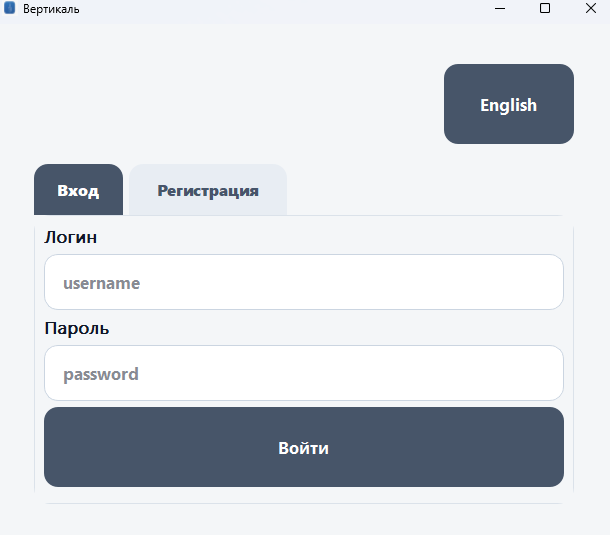
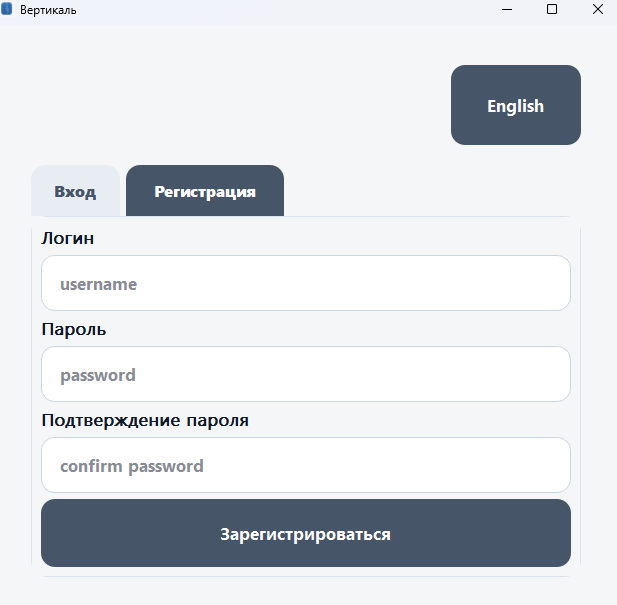
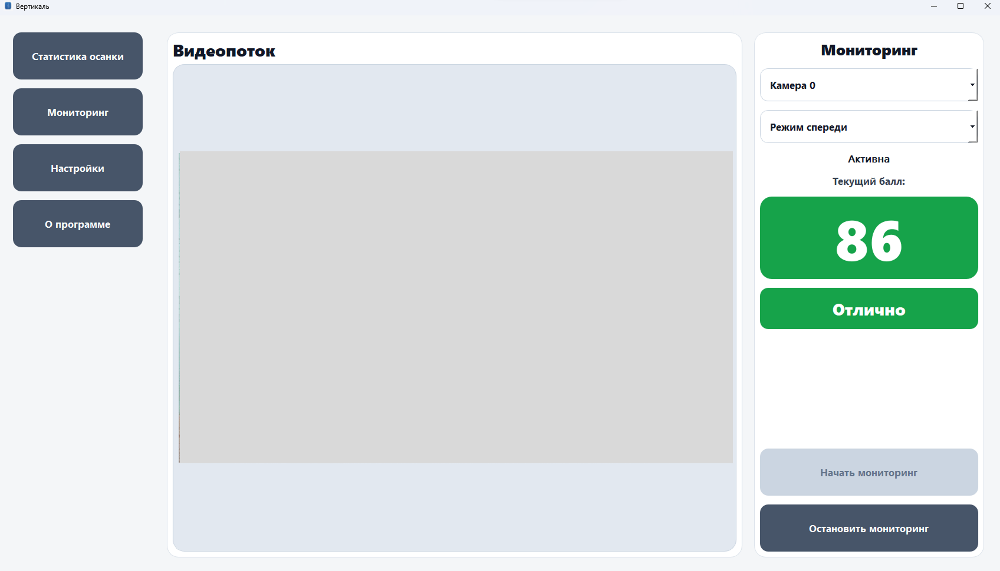
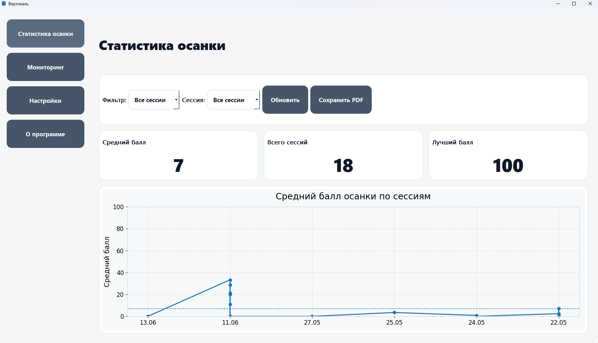
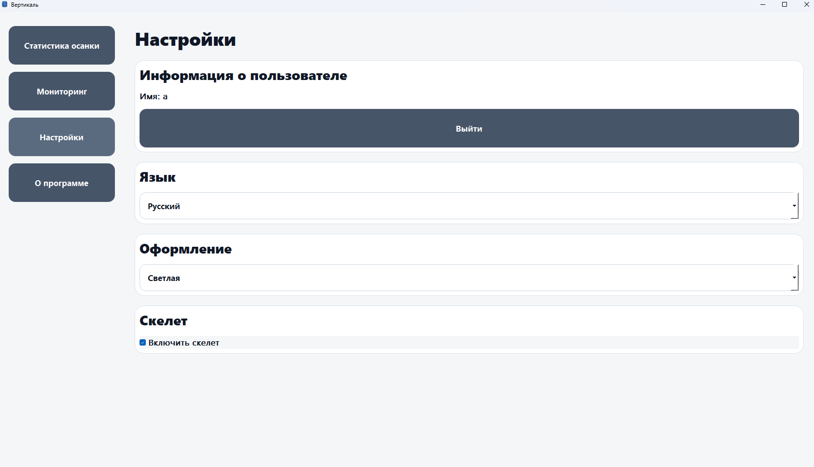

# 🚀 Вертикаль — система контроля осанки

---

## 📌 О проекте

**«Вертикаль»** — это интеллектуальное десктопное приложение для автоматического контроля осанки пользователя при работе за компьютером.

Система использует технологии компьютерного зрения для анализа положения тела через веб-камеру, определяет отклонения от нормы и предоставляет пользователю мгновенную обратную связь в реальном времени.

📍 Основная цель проекта — снижение риска нарушений осанки при длительной работе за ПК за счёт автоматизированного мониторинга и анализа позы пользователя.

---

## ✨ Основные возможности

* 🎥 Захват видеопотока с веб-камеры в реальном времени
* 🧠 Анализ позы человека (MediaPipe Pose)
* 📏 Вычисление углов наклона головы, шеи и корпуса
* ⚠️ Определение нарушений осанки
* 📊 Сбор и хранение статистики сеансов
* 📈 Отображение прогресса пользователя
* 🔔 Уведомления о неправильной позе
* 🧾 Генерация отчетов (PDF)
* 👤 Система пользователей (регистрация / авторизация)

---

## 🧠 Технологии

**Язык и платформы:**

* Python 3.11
* Windows 10 / 11

**Компьютерное зрение:**

* OpenCV
* MediaPipe
* NumPy

**GUI:**

* PyQt5

**База данных:**

* PostgreSQL 17

**Дополнительно:**

* PyInstaller (сборка EXE)
* Inno Setup (установщик)

---

## 🏗 Архитектура системы

Приложение построено по модульной архитектуре:

* `auth/` — авторизация и регистрация пользователей
* `camera/` — работа с веб-камерой
* `core/` — логика сессий и подключение к БД
* `services/` — бизнес-логика анализа осанки
* `ui/` — интерфейс приложения (PyQt5)
* `database/` — SQL-структура
* `locales/` — локализация
* `styles/` — оформление интерфейса
* `utils/` — вспомогательные функции
* `assets/` — ресурсы приложения

---

## ⚙️ Установка (Windows)

### 📦 1. Установка готовой версии

1. Скачайте установщик:

   ```
   VerticalSetup.exe
   ```
2. Запустите установщик
3. Следуйте инструкциям мастера установки
4. Дождитесь завершения установки
5. Запустите приложение с рабочего стола

---
## 📦 Скачать приложение

👉 Последняя версия установщика доступна здесь:

[⬇ Скачать Vertical](https://github.com/pivzor/Vertical/releases/latest)
---

### 🗄 Автоматическая настройка БД

При наличии pgAdmin рекомендуется сохраниить все данные.

Во время установки автоматически:

* устанавливается PostgreSQL 17
* создаётся база данных:

  ```
  pose_db
  ```
* создаются необходимые таблицы
* настраивается подключение:

  * host: `localhost`
  * port: `5432`

---

## 💻 Запуск из исходного кода

### 1. Клонирование проекта

```bash
git clone <repository_url>
cd posture-project
```

### 2. Создание виртуального окружения

```bash
python -m venv venv
venv\Scripts\activate
```

### 3. Установка зависимостей

```bash
pip install -r requirements.txt
```

### 4. Запуск приложения

```bash
python main.py
```

---

## 🧑‍💻 Использование

### 🔐 Авторизация

* Введите логин и пароль
* Нажмите «Войти»

### 🆕 Регистрация

* Создайте учетную запись
* Укажите данные пользователя

### 📹 Мониторинг осанки

* Перейдите в раздел мониторинга
* Включите веб-камеру
* Начните сеанс анализа

### 📊 Статистика

* Просмотр средней оценки осанки
* История сеансов
* Графики изменений

---

## 🧠 Как работает система

1. Захват изображения с камеры
2. Определение ключевых точек тела (MediaPipe)
3. Вычисление углов:

   * шея
   * плечи
   * корпус
4. Расчёт оценки осанки (0–100)
5. Сглаживание результата
6. Отображение состояния пользователю
7. Сохранение данных в PostgreSQL

---

## 📊 Интерфейс приложения

### 🔑 Авторизация


### 📝 Регистрация


### 📹 Мониторинг


### 📊 Статистика


### ⚙️ Настройки


---

## 📊 Оценка осанки

| Балл   | Состояние          |
| ------ | ------------------ |
| 85–100 | Отличная           |
| 70–84  | Хорошая            |
| 55–69  | Удовлетворительная |
| <55    | Нарушение осанки   |

---

## ⚠️ Возможные ошибки

* ❌ Камера не найдена
* ❌ PostgreSQL не запущен
* ❌ Ошибка подключения к БД
* ❌ Отсутствие моделей MediaPipe
* ❌ Ошибка загрузки интерфейса

---

## 🔮 Перспективы развития

* добавление AI-рекомендаций по осанке
* облачная синхронизация данных
* улучшение точности модели анализа
